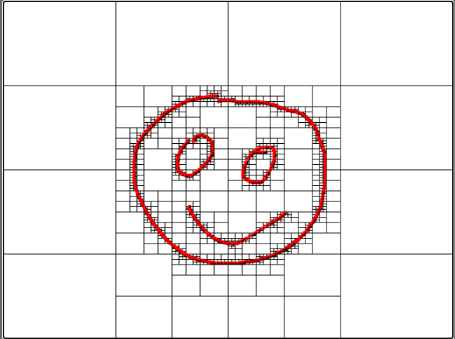
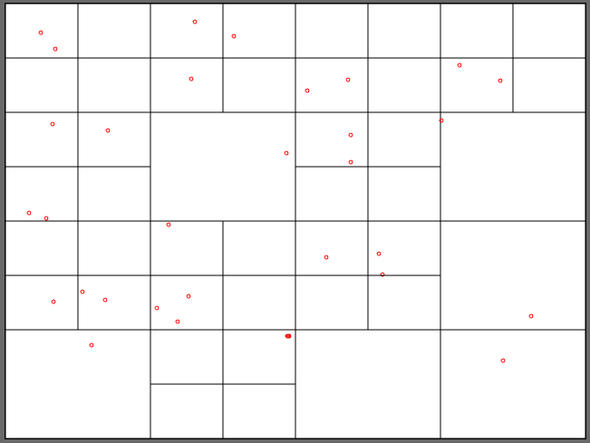
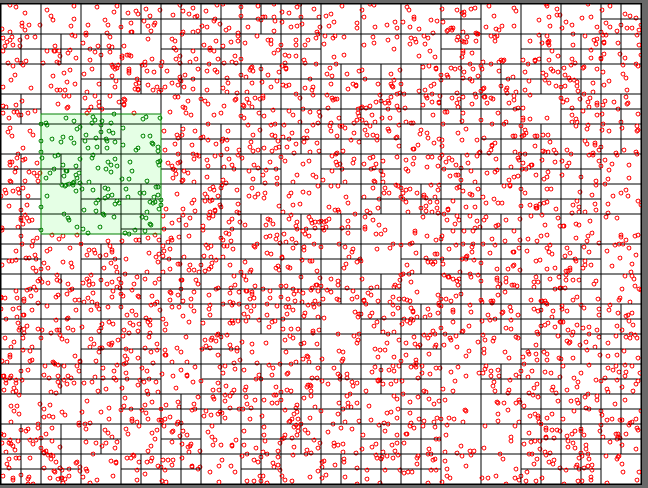

# Quadtree

> Quadtree implementation & demos

## Usage

```ts
const area = new Rectangle(640, 480, new Point(640/2, 480/2));
const quadtree = new QuadTree(area, 3, 3);

const queryArea = new Rectangle(120, 120, new Point(randomInt(0, 640), randomInt(0, 480)));
const pointsFound = quadtree.query(queryArea);
```

## Interactive Demo

Run the interactive canvas demo:

```shell
npm run demo
```

This will start a Vite dev server and open your browser to http://localhost:5173/

**Features:**
- Click and drag to draw points on the canvas
- Watch the quadtree subdivide in real-time as you add points
- Points are displayed as red circles
- Quadtree boundaries are shown as grey lines
- View live stats showing total points and quadrants
- Clear button to reset the visualization

## Available Scripts

### Build

```shell
npm run build
```

Bundles the library using esbuild.

### Test

```shell
npm run test
```

Run the test suite with Vitest.

For coverage:

```shell
npx vitest --coverage
```

### Lint

```shell
npm run lint
```

Run ESLint on the source code (requires ESLint configuration).

### Demo

```shell
npm run demo
```

Launch the interactive quadtree visualization demo.

## Benchmarks

```shell
npx vitest bench --run --testNamePattern=queryArea QuadTree.bench.ts
```

## Examples

Quadtree line example



Quadtree with maxDepth=3



Query on quadtree with maxDepth=10 (3000 points)


