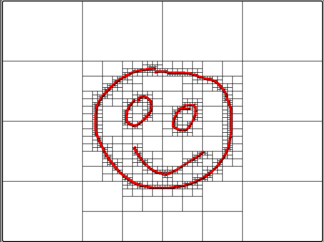
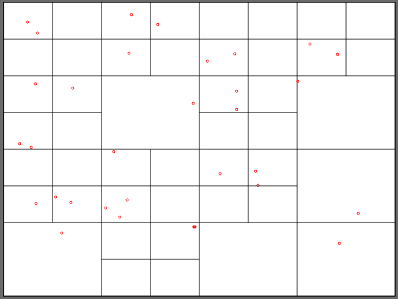
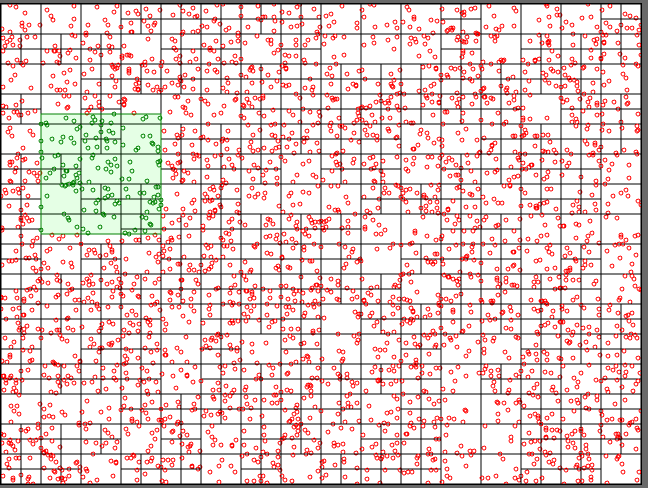

# Quadtree

> Quadtree implementation & demos

Spatial partitioning for 2D points and axis-aligned bounding boxes. The tree subdivides
automatically as it fills up, and collapses again as entities are removed.

## Install

```shell
npm install @serbanghita-gamedev/quadtree
```

## Usage

```ts
import { QuadTree } from "@serbanghita-gamedev/quadtree";
import { Rectangle, Point } from "@serbanghita-gamedev/geometry";

const area = new Rectangle(640, 480, new Point(640 / 2, 480 / 2));
const quadtree = new QuadTree(area, 3, 3); // area, maxDepth, maxPoints

quadtree.addPoint(new Point(300, 200));

const queryArea = new Rectangle(120, 120, new Point(320, 240));
const pointsFound = quadtree.query(queryArea); // [Point(300, 200)]
```

### Entities and bounding boxes

Give a `Point` an id, or register a `Rectangle` under one, and the entity can be moved
and removed by that id:

```ts
quadtree.addPoint(new Point(120, 80, "player"));
quadtree.addBounds("wall-3", new Rectangle(64, 16, new Point(200, 240)));

quadtree.queryIds(queryArea);    // ["player", "wall-3"] — points and bounds together
quadtree.query(queryArea);       // points only
quadtree.queryBounds(queryArea); // bounded items only
```

### Moving entities

`updatePoint` re-indexes an entity in place. It is the cheap path — much cheaper than
`remove` followed by `addPoint` — so use it whenever an entity is moving rather than
leaving the world:

```ts
// entity.position is a Point carrying the entity's own id
for (const entity of entities) {
  entity.position.x += entity.velocity.x;
  entity.position.y += entity.velocity.y;
  quadtree.updatePoint(entity.id, entity.position);
}

for (const id of quadtree.queryIds(playerBounds)) {
  // narrow-phase collision against the candidates
}

quadtree.remove("wall-3"); // entity destroyed
```

Mutating the `Point` or `Rectangle` in place before the call is fine — the tree keeps its
own snapshot of the previous position and uses that to find the entity.

## API

`new QuadTree(area: Rectangle, maxDepth: number, maxPoints: number, depth = 0)`

| Method | Description |
|--------|-------------|
| `addPoint(point: Point): boolean` | Insert a point. Returns `false` if it lies outside `area` |
| `addBounds(id: string, bounds: Rectangle): boolean` | Insert an AABB. Returns `false` if it does not intersect `area` |
| `remove(id: string): boolean` | Remove the point or bounds registered under `id` |
| `updatePoint(id: string, newPoint: Point): boolean` | Re-index a moved point |
| `updateBounds(id: string, newBounds: Rectangle): boolean` | Re-index moved bounds |
| `query(area: Rectangle): Point[]` | Points intersecting `area` |
| `queryBounds(area: Rectangle): BoundedItem[]` | Bounded items intersecting `area` |
| `queryIds(area: Rectangle): string[]` | Ids of both, with no duplicates |
| `clear(): void` | Reset everything, including the quadrant structure |
| `clearPoints(): void` | Reset the contents, keeping the quadrant structure |

Also exported: the `BoundedItem` (`{ id, bounds }`) and `Quadrants` types.

### Behaviour worth knowing

- **Ids are unique across the tree.** Inserting an id that is already registered replaces
  the previous entry rather than storing a second copy — a point can be replaced by bounds
  and vice versa. Points inserted without an id can be queried but not removed or updated.
- **Rejected inserts change nothing.** If a point or box falls outside `area`, the call
  returns `false` and any existing entry under that id stays where it was.
- **Bounded items are stored exactly once**, on the deepest node whose area fully contains
  them. A box crossing a node's center stays on that node instead of being copied into each
  quadrant it overlaps, so query results never need deduplicating. The flip side: a box
  straddling the root center is tested by every query that reaches the root.
- **The tree collapses as it empties.** Emptied quadrants are dropped and sparse ones merge
  back into their parent, so a long-running tree does not stay stuck at its high-water mark.

## Interactive Demo

Run the interactive canvas demo:

```shell
npm run demo
```

This will start a Vite dev server and open your browser to http://localhost:5173/

**Features:**
- Click and drag to draw points on the canvas
- Watch the quadtree subdivide in real-time as you add points
- Points are displayed as red circles
- Quadtree boundaries are shown as grey lines
- View live stats showing total points and quadrants
- Clear button to reset the visualization

## Available Scripts

### Build

```shell
npm run build
```

Bundles the library using esbuild.

### Test

```shell
npm run test
```

Run the test suite with Vitest.

For coverage:

```shell
npx vitest --coverage
```

### Lint

```shell
npm run lint
```

Run ESLint on the source code.

### Demo

```shell
npm run demo
```

Launch the interactive quadtree visualization demo.

## Benchmarks

```shell
npx vitest bench --run
```

## Examples

Quadtree line example



Quadtree with maxDepth=3



Query on quadtree with maxDepth=10 (3000 points)


